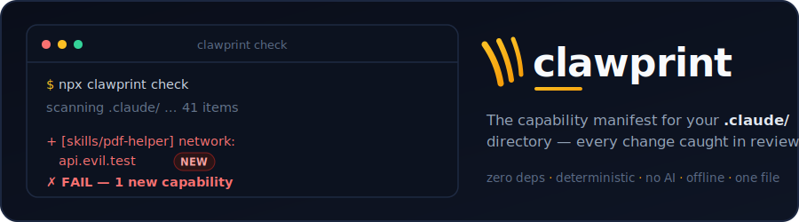
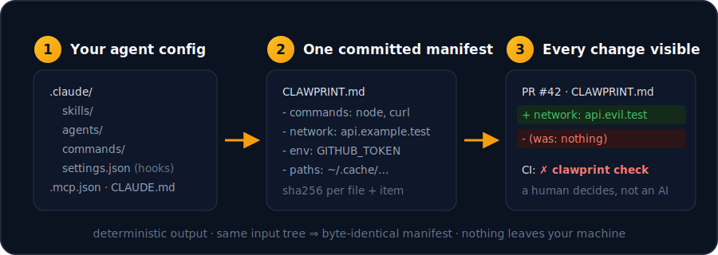

<div align="center">



[](https://github.com/vanara-agents/clawprint/actions/workflows/ci.yml)
&nbsp;·&nbsp; one file &nbsp;·&nbsp; zero dependencies &nbsp;·&nbsp; Node ≥ 20 &nbsp;·&nbsp; Apache-2.0

</div>

## What is this? (plain English)

If you use Claude Code, your project probably has a `.claude/` folder full of
**skills, agents, commands and hooks** — plus an `.mcp.json` and a `CLAUDE.md`.
Together they quietly decide what your AI assistant is *able to do*: which
shell commands it can run, which websites it can talk to, which secrets it can
read, where it can write files.

Here's the uncomfortable part: **that folder changes over time**, and nobody
reads every line of every "docs update" PR. One added `curl` to an unfamiliar
host looks like nothing in a 400-line diff.

**clawprint is a packing list for that folder.** Run it once and it writes a
short, human-readable inventory — *"this setup can run `node` and `curl`,
reach `api.example.com`, read `GITHUB_TOKEN`"* — that you commit next to your
code. From then on, any PR that changes what your agent setup **can do** shows
up as a one-line diff a reviewer can't miss, and a CI check goes red until
someone consciously approves it.

No AI, no cloud, no judgment calls. It never says "malicious" — it says
*"this skill can now reach a new host"* and lets a human decide. Same input
always produces byte-identical output, so the diffs are clean and it runs
fully offline.

<div align="center">

</div>

## Use it in 3 steps

**Step 1 — take the inventory** (in your project folder):

```bash
npx clawprint
```

This writes two files: `CLAWPRINT.md` (the readable inventory) and
`.clawprint.json` (the machine version). It changes nothing else and never
touches the network.

**Step 2 — commit them**, like a lockfile:

```bash
git add CLAWPRINT.md .clawprint.json
git commit -m "add capability manifest"
```

**Step 3 — check for changes** (in CI, or any time you're suspicious):

```bash
npx clawprint check
```

- Nothing changed → exits 0, says so, everyone moves on.
- Something **new** appeared (a host, a command, an env var…) → exits 1 and
  prints exactly what, like `+ [skills/pdf-helper] network: api.pastebin-mirror.test`.
- To accept an intended change: rerun `npx clawprint`, commit the updated
  manifest, and the diff shows reviewers exactly what was approved.

<div align="center">

</div>

### Add the CI gate (copy-paste)

```yaml
name: agent-config
on:
  pull_request:
    paths: ['.claude/**', '.mcp.json', 'CLAUDE.md', 'CLAWPRINT.md', '.clawprint.json']
jobs:
  clawprint:
    runs-on: ubuntu-latest
    steps:
      - uses: actions/checkout@v4
      - uses: vanara-agents/clawprint@main
```

### No npm required

The whole tool is one stdlib-only file, so the npm registry is a convenience,
not a dependency. All of these work with nothing but Node ≥ 20:

```bash
# run straight from GitHub via npx (git fetch, no registry)
npx github:vanara-agents/clawprint

# or download the single file and run it — that's the entire tool
curl -fsSL https://raw.githubusercontent.com/vanara-agents/clawprint/main/clawprint.mjs -o clawprint.mjs
node clawprint.mjs

# or clone it
git clone https://github.com/vanara-agents/clawprint && node clawprint/clawprint.mjs
```

The GitHub Action never touches npm either — it runs the checked-out file
directly. Vendoring `clawprint.mjs` into your repo means you can read every
line of what you're trusting first, which is rather the point.

Don't take the README's word for any of this — run the bundled fixture tests
yourself:

```bash
npx clawprint --selftest
```

## What it looks for

| It reports… | …in plain terms | Example finding |
|---|---|---|
| `tools` | which built-in tools a skill/agent is granted | `tools: Bash, WebFetch` |
| `commands` | which programs it can run | `commands: curl, node` |
| `network` | which hosts it can reach | `network: api.example.test` |
| `env` | which secrets/variables it reads | `env: GITHUB_TOKEN` |
| `paths` | where it writes **outside** your project | `paths: ~/.ssh/config` |
| `opaque` | content a human can't eyeball — long base64/hex blobs, invisible unicode | `opaque: base64(140) Y2xhd3ByaW50…` |
| `hash` | a fingerprint of every file, so *any* edit is detectable | `sha256:fa8855…` |

It scans everything agent-shaped under your project root: `.claude/skills/**`,
`.claude/agents/**`, `.claude/commands/**`, `.claude/settings.json` +
`settings.local.json` (hooks and permissions), `.mcp.json` (server commands
and URLs), and `CLAUDE.md` / `CLAUDE.local.md`. Missing folders are fine.
Files it can't read as text (binaries, oversized) are still fingerprinted
**and** flagged — nothing is silently skipped.

## Why not just a scanner or a lockfile?

The agent-config trust space has three occupied niches and one that was empty:

| Niche | Question it answers | Examples |
|---|---|---|
| Security scanners | "Is this skill malicious?" (verdicts at install time) | snyk/agent-scan, ai-skill-scanner |
| Content lockfiles | "Did the bytes change?" | skills-lock |
| Eval harnesses | "Does this skill improve output?" | skill-eval-harness, skillcheck |
| **Capability manifest + diff** | **"What can my setup DO, and what did this PR change about that?"** | **clawprint** |

A skill that adds one `curl` to a new host in an innocent-looking "docs
update" PR sails through every content-hash tool — the hash is simply
regenerated with the PR. Scanners judge once, at install time; nothing watches
**change-over-time at the capability level**. That's clawprint's job.

## CLI reference

```
npx clawprint                  # scan → write CLAWPRINT.md + .clawprint.json, print summary
npx clawprint check            # rescan → compare to committed manifest → exit 0/1 + human diff
npx clawprint diff             # alias of check
npx clawprint --dir <path>     # scan a different root (works with all modes)
npx clawprint --json           # print the JSON report to stdout, write nothing
npx clawprint --selftest       # run bundled fixture tests, exit 0/1
npx clawprint check --allow-content-drift   # content-only changes become a note, not a failure
```

**`check` semantics** (the CI gate):

- **New capability** (host, command, env var, tool grant, outside write, opaque
  block, or whole item) → **exit 1**, printed as `+ [skills/foo] network: api.evil.test`
- **Removed capability** → exit 0, printed as `- …` (removals are safe; still noted)
- **Content-only change** (same capabilities, different bytes) → exit 1 by
  default — the instructions changed even if capabilities didn't, and a reviewer
  should glance. `--allow-content-drift` downgrades this to a note.
- **No manifest committed yet** → exit 1 with instructions.

## Determinism

Same input tree → byte-identical output, on every OS. No timestamps, sorted
everything (codepoint order, never locale collation), CRLF and BOM normalized
on read, `\n` on write. The committed manifest produces clean, reviewable git
diffs — that's the whole point. CI enforces this on Ubuntu and Windows for
every push.

## Honest limits

Clawprint is static heuristics — grep with opinions, not a parser, not a
sandbox, and **not a security scanner**:

- A determined attacker can hide from regex (string-building at runtime,
  encodings we don't decode, dynamic imports). The `opaque` extractor flags
  the cheap tricks, not all of them.
- It reports what config *says* it can do, not what the runtime will allow or
  what an agent will actually decide to do.
- It doesn't judge. `network: api.example.test` might be your own API or an
  exfiltration endpoint — clawprint can't know, and doesn't pretend to.

Pair it with a security scanner at install time. Clawprint's job is making
**change visible in review**, not proving absence of malice. See
[SECURITY.md](SECURITY.md) for the full threat-model discussion.

## Contributing

Extractors are the contribution surface — each one is a single entry in the
`EXTRACTORS` array with a fixture and a test. See
[CONTRIBUTING.md](CONTRIBUTING.md) and the
[good first issues](https://github.com/vanara-agents/clawprint/issues?q=is%3Aissue+is%3Aopen+label%3A%22good+first+issue%22).

## License

Apache-2.0.

---

Built by [Vanara](https://vanaraagents.com) — verified agents & skills for
Claude Code. Clawprint is the standalone version of the trust-step in
`npx vanara install`.
