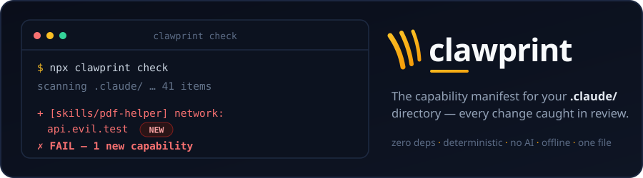
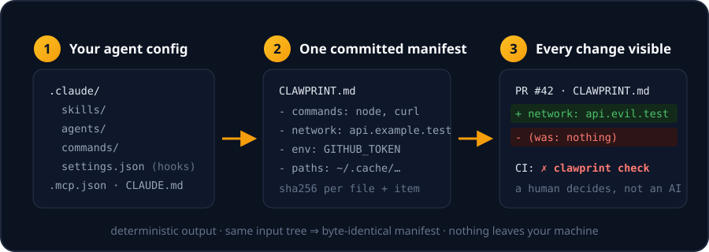

<div align="center">



[](https://github.com/vanara-agents/clawprint/actions/workflows/ci.yml)
&nbsp;·&nbsp; one file &nbsp;·&nbsp; zero dependencies &nbsp;·&nbsp; Node ≥ 20 &nbsp;·&nbsp; Apache-2.0

</div>

## The 30-second version

If you use an AI coding assistant (Claude Code, Cursor, Copilot…), your project
contains **instruction files that tell the AI what it's allowed to do** — which
programs it can run, which websites it can contact, which passwords and keys it
can read.

Those files change over time. Teammates edit them, tools install into them,
and nobody re-reads them. One sneaky line — say, an instruction to send data
to an unfamiliar website — hides easily inside a big "docs update".

**clawprint is a smoke detector for those files.** It writes down, in plain
English, everything your AI setup is currently able to do — and from then on,
**any change to that list sets off the alarm** before it reaches your main
branch. A human looks, says "yes I meant that" or "no, what is THIS?", and
life goes on.

It's one small file of code. No AI inside, no cloud, nothing leaves your
machine, and it never renders verdicts — it just tells you *what changed* and
lets you decide.

<div align="center">

</div>

## Use it in 3 steps

**Step 1 — take the inventory.** In your project folder, run:

```bash
npx clawprint
```

This writes two small files: `CLAWPRINT.md` (a readable list of what your AI
setup can do — open it, it's meant for humans) and `.clawprint.json` (the same
thing for machines). It changes nothing else and never touches the internet.

**Step 2 — save the inventory with your code:**

```bash
git add CLAWPRINT.md .clawprint.json
git commit -m "add capability manifest"
```

Think of it like the packing list taped to a moving box: now there's a record
of what's supposed to be inside.

**Step 3 — check the box whenever anything changes:**

```bash
npx clawprint check
```

- Nothing changed → it says so and exits quietly.
- Something **new** appeared — a website, a program, a secret being read —
  → it fails loudly and prints exactly what, like:
  `+ [skills/pdf-helper] network: api.pastebin-mirror.test`
  (translation: *"the pdf-helper skill can now talk to a website it couldn't
  talk to before"*).
- If the change was intentional: rerun `npx clawprint`, commit the updated
  list, and your reviewers see exactly what was approved.

<div align="center">

</div>

### Make it automatic (recommended)

Paste this into `.github/workflows/agent-config.yml` and GitHub will run the
check on every pull request that touches your AI config — no one has to
remember anything:

```yaml
name: agent-config
on:
  pull_request:
    paths: ['.claude/**', '.mcp.json', 'CLAUDE.md', 'CLAWPRINT.md', '.clawprint.json']
jobs:
  clawprint:
    runs-on: ubuntu-latest
    steps:
      - uses: actions/checkout@v4
      - uses: vanara-agents/clawprint@main
```

## What it looks for

| It reports… | …meaning | Example finding |
|---|---|---|
| `tools` | which built-in abilities the AI is granted | `tools: Bash, WebFetch` |
| `commands` | which programs it can run on your computer | `commands: curl, node` |
| `installs` | which software it installs while running | `installs: requests, colorama` |
| `network` | which websites/servers it can contact | `network: api.example.test` |
| `env` | which secrets and settings it reads | `env: GITHUB_TOKEN` |
| `paths` | where it writes files **outside** your project | `paths: ~/.ssh/config` |
| `opaque` | content no human can eyeball — encoded blobs, invisible characters | `opaque: base64(140) Y2xhd3ByaW50…` |
| `symlinks` | config whose real content lives **outside** your repo (it can change with no diff here) | `symlinks: /home/x/elsewhere/SKILL.md` |
| `hash` | a fingerprint of every file, so *any* edit at all is detectable | `sha256:fa8855…` |

### Where it looks

Everything agent-shaped in your project — not just Claude:

- **Claude Code** — `.claude/` (skills, agents, commands, hooks, settings), `CLAUDE.md`
- **MCP** — `.mcp.json`, `.cursor/mcp.json` (which servers, which URLs)
- **Cursor** — `.cursor/rules/*.mdc`, legacy `.cursorrules`
- **Codex / cross-tool** — `AGENTS.md` · **Gemini CLI** — `GEMINI.md`
- **GitHub Copilot** — `.github/copilot-instructions.md`
- **Windsurf / Cline** — `.windsurfrules`, `.clinerules`

Files that are missing are fine. Files it can't read as text are still
fingerprinted **and** flagged — nothing gets silently skipped.

## Beyond the alarm: rules, live protection, and the big picture

The manifest tells you what changed. Four more commands build on it:

**Write house rules — `clawprint.policy.json`.** The manifest asks *"did
anything change?"*; a policy asks *"is anything forbidden?"* Drop a small
rules file in your repo and `check` enforces it:

```json
{
  "network": { "allow": ["api.github.com", "*.mycorp.com"] },
  "env": { "deny": ["AWS_*", "*_SECRET*"] },
  "installs": false
}
```

Translation: *"my AI setup may only talk to GitHub and our own servers, may
never read cloud keys or secrets, and may never install software at
runtime."* Anything that breaks a rule fails the check with a `!` line naming
the rule — even if it was in the config all along. Also available:
`tools: {"deny": ["Bash"]}` (no skill may get shell), `installs: {"allow":
[...]}` (allowlist instead of on/off), and `"symlinks": false` (no config
sourced from outside the repo). Preview what a policy would flag *before*
committing it: `npx clawprint policy` (add `--json` for tooling).

**Live protection — `clawprint guard`.** The check runs at review time; guard
runs at the moment the AI is *about to execute a command*. Hook it into
Claude Code and every shell command gets compared against the packing list
first — a command reaching for a website that's not on the list gets flagged
(or blocked, with `--enforce`) *before it runs*:

```json
{ "hooks": { "PreToolUse": [ { "matcher": "Bash", "hooks": [
  { "type": "command", "command": "npx clawprint guard --enforce" }
] } ] } }
```

It fails open by design: no manifest → it warns and allows. A guard that
bricks your session gets uninstalled, not fixed. Guard watches more than
shell: **WebFetch** URLs are checked against your allowed hosts, and **file
writes outside your project** are flagged unless the manifest already
declares that target. It also honors your *global* manifest (below), so
globally installed skills don't trip false alarms.

**Don't forget the machine-wide config — `--global`.** A skill installed in
`~/.claude` grants its capabilities in **every** project, yet appears in no
repo's manifest. `npx clawprint --global` gives your global config a manifest
of its own (written into `~/.claude/`), and `npx clawprint check --global`
tells you when *it* changes — the blind spot most setups never look at.

**The story over time — `clawprint log`.** Scan with `--history` and each
run appends a dated snapshot. `clawprint log` then shows how your setup's
reach has grown — *"gained 12 websites and 3 secret-reads since March, here's
when each arrived."*

**The whole org — `clawprint fleet`.** Point it at a folder of repos and get
one report: every website, secret, and program your organization's agent
setups can touch, and which repo can touch what. And `clawprint badge`
writes a [shields.io](https://shields.io) badge file so a repo can wear its
capability surface on the README.

## Also: what does your setup *cost*?

Every session, your AI reads some of these instruction files before you type a
single word. That reading costs **tokens** — the currency AI usage is billed
and rate-limited in. Configs grow quietly; the bill grows with them.

```bash
npx clawprint weigh            # what does this project's config cost per session?
npx clawprint weigh --global   # include your machine-wide ~/.claude config too
```

```
TOKEN USAGE — total context every session starts with
  global (~/.claude)                              27,800 chars   ~6,950 tokens
  project (this repo)                                  0 chars       ~0 tokens
  per session (total)                             27,800 chars   ~6,950 tokens
```

It splits the cost into what's loaded **always**, what's loaded **only when a
skill is used**, and what's loaded **only if the AI opens a reference file** —
so you know what to trim first. Character counts are exact; token figures are
labeled estimates. You can set a budget and fail CI when config bloat crosses
it:

```bash
npx clawprint weigh --budget 15000    # alarm if the always-loaded cost exceeds this
```

What weigh will **not** do: predict what a specific conversation will cost, or
claim a skill "saves tokens". That depends on the model at runtime, and a
static tool printing such a number would be making it up. Details in
[docs/WEIGH-SPEC.md](docs/WEIGH-SPEC.md).

## Don't trust us — you don't have to

The entire tool is **one file with zero dependencies**. You can read every
line of what you're trusting before you run it:

```bash
# run without the npm registry at all (fetches from GitHub)
npx github:vanara-agents/clawprint

# or just download the one file and run it — that's the whole tool
curl -fsSL https://raw.githubusercontent.com/vanara-agents/clawprint/main/clawprint.mjs -o clawprint.mjs
node clawprint.mjs
```

And it checks itself — bundled fixture tests you can run any time:

```bash
npx clawprint --selftest
```

Same input always produces byte-identical output on every OS (no timestamps,
everything sorted, line-endings normalized) — which is why the committed
inventory produces clean, readable git diffs. CI enforces this on Ubuntu and
Windows for every push.

## How it compares

| Kind of tool | Question it answers |
|---|---|
| Security scanners | "Is this skill malicious?" — a verdict, once, at install time |
| Content lockfiles | "Did the bytes change?" — yes/no, no meaning attached |
| Eval harnesses | "Does this skill improve output?" |
| **clawprint** | **"What can my setup DO — and what did this change add?"** |

The gap it fills: a skill that adds one `curl` to a new host in an innocent
"docs update" sails through every hash-based tool (the hash just gets
regenerated) and past any scanner that already ran at install time. Nothing
was watching **change-over-time at the what-can-it-do level**. That's the job.

## CLI reference

```
npx clawprint                  # scan → write CLAWPRINT.md + .clawprint.json, print summary
npx clawprint check            # rescan → compare to committed manifest → exit 0/1 + human diff
npx clawprint diff             # alias of check
npx clawprint weigh            # estimated context cost: always / on-invoke / referenced tiers
npx clawprint weigh --top 10   # list the 10 heaviest items per tier (default 5)
npx clawprint weigh --global   # add the ~/.claude tier + total tokens per session
npx clawprint weigh --budget N # exit 1 if the always-loaded estimate exceeds N tokens
npx clawprint weigh --brief    # one line, made for SessionStart hooks
npx clawprint guard            # PreToolUse hook: check a live Bash command against the manifest
npx clawprint guard --enforce  # …and block (exit 2) instead of warn
npx clawprint --history        # in scan mode: append a dated snapshot to .clawprint-history.jsonl
npx clawprint log              # capability growth over time, with per-snapshot deltas
npx clawprint fleet <dir>      # scan every repo under <dir> → one org-wide capability report
npx clawprint badge            # write .clawprint-badge.json (shields.io endpoint schema)
npx clawprint --dir <path>     # scan a different root (works with all modes)
npx clawprint --json           # print the JSON report to stdout, write nothing
npx clawprint --sarif          # print a SARIF 2.1.0 report (for the GitHub Security tab)
npx clawprint --selftest       # run bundled fixture tests, exit 0/1
npx clawprint check --allow-content-drift   # content-only changes become a note, not a failure
```

The GitHub Action can also **post the capability diff as a PR comment**
(updated in place, never duplicated) — add `comment: 'true'` to its `with:`
block and give the job `pull-requests: write` permission.

**`check` semantics** (the CI gate): a **new** capability (host, command, env
var, tool grant, outside write, opaque block, or whole item) fails the check;
a **removed** one passes with a note (removals are safe); a **content-only**
change (same abilities, different wording) fails by default — the instructions
changed and a reviewer should glance — unless you pass
`--allow-content-drift`. More patterns — policy gates, PR-comment bots,
capability forensics with `git bisect`, org-wide inventory — live in
**[docs/recipes.md](docs/recipes.md)**.

## In your editor (VS Code)

Prefer a panel to a terminal? The **clawprint** sidebar in [`vscode/`](vscode)
shows the same picture live — capabilities, context weight (project + global),
and the manifest-check diff — refreshing as you edit `.claude/`. It runs the
same CLI underneath, so the numbers always match your CI.

## Honest limits

clawprint is pattern-matching with opinions — not a parser, not a sandbox,
and **not a security scanner**:

- A determined attacker can hide from patterns (building strings at runtime,
  encodings it doesn't decode). The `opaque` detector catches the cheap
  tricks, not all of them.
- It reports what the config *says* it can do — not what the runtime will
  permit, or what an AI will actually decide to do on a given day.
- It doesn't judge. `network: api.example.test` might be your own API or an
  exfiltration endpoint — clawprint can't know, and doesn't pretend to.

Pair it with a security scanner at install time. clawprint's job is making
**change visible to a human in review**, not proving the absence of malice.
Full threat-model discussion in [SECURITY.md](SECURITY.md).

## Contributing

Extractors are the contribution surface — each is a single entry in the
`EXTRACTORS` array with a fixture and a test. See
[CONTRIBUTING.md](CONTRIBUTING.md) and the
[good first issues](https://github.com/vanara-agents/clawprint/issues?q=is%3Aissue+is%3Aopen+label%3A%22good+first+issue%22).

## License

Apache-2.0.

---

Built by [Vanara](https://vanaraagents.com) — verified agents & skills for
Claude Code. clawprint is the standalone version of the trust-step in
`npx vanara install`.
